 

&nbsp;

### 腕 &nbsp;— &nbsp; The Arsenal

<!-- swap these for your real stack, e.g. i=python,react,nodejs,mongodb,docker,aws -->

### 道 &nbsp;— &nbsp; The Path Walked

### 記録 &nbsp;— &nbsp; Chronicle of Deeds

### 誉 &nbsp;— &nbsp; Trophies Earned

### 影 &nbsp;— &nbsp; Trail of Commits

<table align="center">
<tr><td>

**心 — The Bushido of Clean Code**

| Virtue | In Practice |
|---|---|
| 義 &nbsp;Rectitude | I ship what's right, not what's easiest |
| 勇 &nbsp;Courage | I refactor fearlessly when the code demands it |
| 仁 &nbsp;Benevolence | I write for the next person who reads this |
| 礼 &nbsp;Respect | I document, I comment, I credit |
| 誠 &nbsp;Honesty | Bugs get reported, not buried |
| 名誉 &nbsp;Honor | My commits are my word |

</td></tr>
</table>

### 絆 &nbsp;— &nbsp; Bonds Forged

